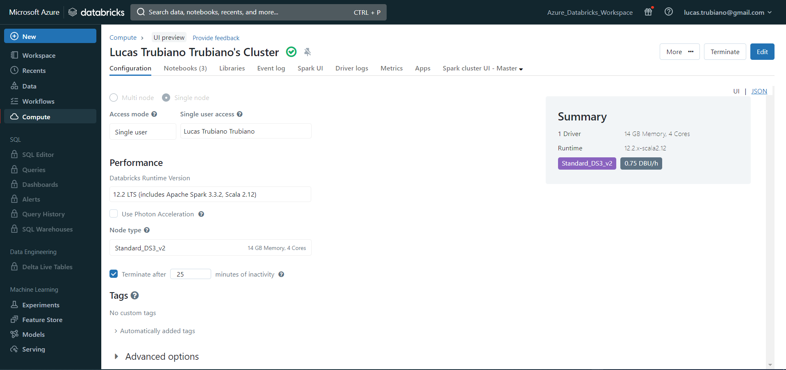
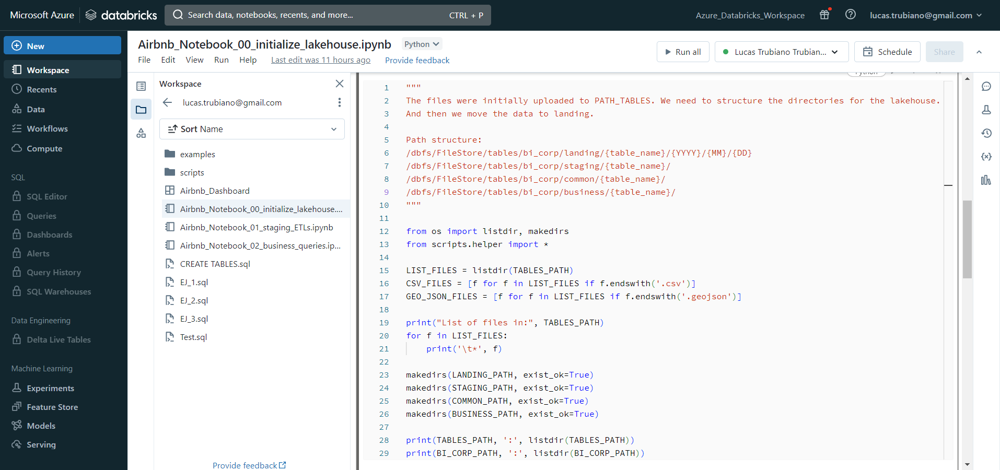
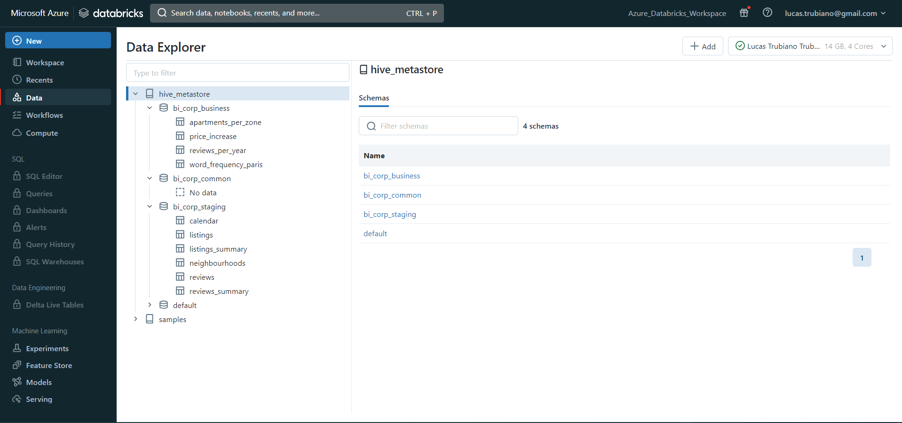
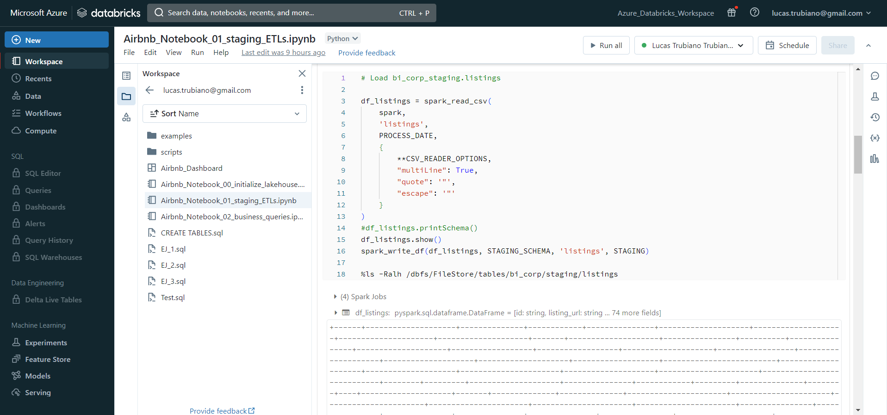
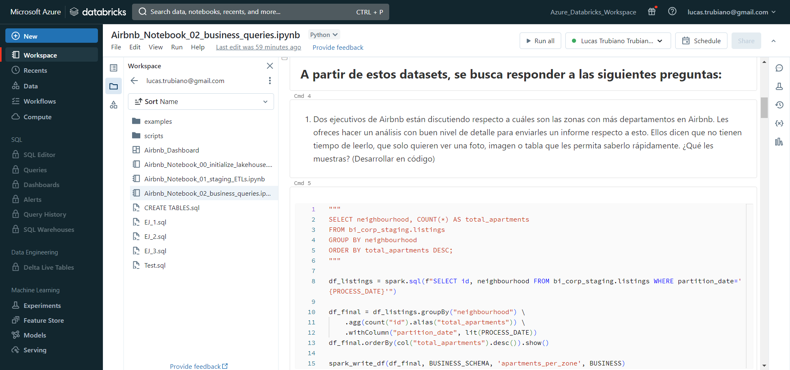

# Data_Eng_Airbnb
Aplicando Data Engineering para resolver un caso práctico de Airbnb dentro de Azure Databricks.

## Sets de datos utilizados:
* `listings.csv`: incluye información de los alojamientos que existen en París, incluyendo
su descripción, cantidad de habitaciones, precio por noche, entre otras variables.
* `listings_summary.csv`: consiste en el mismo dataset de `listings.csv`, solo que con
una menor cantidad de columnas.
* `reviews.csv`: incluye información de las reseñas que los usuarios dieron en la
plataforma. Incluye la fecha en la que se escribió, el texto de la reseña, el nombre
del usuario, entre otras variables.
* `reviews_summary.csv`: consiste en el mismo dataset de `reviews.csv`, solo que con
una menor cantidad de columnas.
* `neighbourhoods.geojson`: incluye el nombre de los distintos barrios que conforman
la ciudad, además de un objeto que incluye un arreglo de las coordenadas que
delimitan al barrio.
* `calendar.csv`: incluye información a futuro de los días en el año para reservar cada
alojamiento (es análogo al calendario que se observa en la página web al querer
reservar un alojamiento). Incluye disponibilidad día a día, el precio para ese día, entre
otros.

## Entorno de trabajo:
* Microsoft Azure
* Databricks
* Spark 3.3.2
* Scala 2.12
* Spark SQL
* Python 3.9.5



## Configuración del Datalake:
Scripts utilizados:
* `Airbnb_Notebook_00_initialize_lakehouse.ipynb`: Crea estructura de carpetas en DBFS (Databricks File System) y mueve los archivos de datos (CSV's) a la carpeta `landing`.
* `Create_Tables.sql`: Crea las tablas que se utilizarán en el proyecto. Lo hace en 3 zonas de trabajo: `staging`, `common` y `business`.
    * `staging`: Tablas que almacenan la data cruda (sin procesar) tal como se encuentra en los archivos CSV's.
    * `common`: Tablas que almacenan la data procesada y limpia, lista para ser utilizada en el análisis de datos. *Para este caso no hemos creado ninguna tabla en esta capa por simplicidad pero sería bueno tener esta capa para almacenar la data procesada y limpia.*
    * `business`: Tablas que almacenan las metricas de negocio que se utilizarán para el análisis de datos. Son tablas que ya tienen los calculos realizados y sirven para realizar consultas de manera más eficiente o visualizaciones de datos.
    * Todas las tablas están creadas como **EXTERNAL TABLES**, lo que significa que los datos no se almacenan en la base de datos, sino que se almacenan en el Datalake (DBFS), esto nos permite resguardar los datos aunque la tabla se elimine. La base de datos solo tiene un puntero a la ubicación de los datos.
    * Las tablas están particionadas por **partition_date** (fecha de proceso), lo que permite realizar consultas más eficientes.
    * También las tablas están almacenadas en formato **PARQUET**, lo que permite un mejor rendimiento en las consultas y un menor consumo de espacio en disco (ya que tenemos compresión de la información).




## Carga de datos en **staging**:
Mediante el notebook `Airbnb_Notebook_01_staging_ETLs.ipynb` cargamos los datos de los archivos CSV's a las tablas de la capa `staging`.

> `helper.py`: En la carga de datos a `staging` las operaciones de lectura de los archivos CSV's y escritura en las tablas de la capa `staging` se realizan con Spark y como es algo que se reutiliza en varias tablas, se ha creado script de Python que sirve para agrupar todas estas funcionalidades. El script se llama `helper.py` y se encuentra en la carpeta `scripts`.
>
> Contiene:
> * **CONSTANTES**: Rutas de las diferentes carpetas. Parametros de configuración de Spark. Opciones para configurar los Readers y Writers de Spark.
> * **Funciones**: Funciones como `spark_read_csv()` para leer los archivos CSV's y `spark_write_df()` para escribir los parquet en las ubicaciones correspondientes.
>

Algunos CSV's requieren configuraciones especiales para su lectura, por ejemplo, `listings.csv` o `reviews.csv` que algunos campos contienen saltos de linea y Spark no los lee correctamente a menos que se especifique el parámetro `multiLine=True` en el Reader.
```python
"""
La utilización de inferSchema=True puede ser muy costosa en terminos de performance. Por lo tanto podemos optar por:
    * Especificar el schema de la tabla (opción más recomendada). Habría que conocer bien todos los datos y saber que no va a venir nada que sea inconsistente.

    * O podemos utilizar inferSchema=False e ingestar todo como string y luego hacer las conversiones necesarias. Esto es más costoso en terminos de almacenamiento en disco pero más seguro. Y a efectos del ejercicio no es un problema ya que no tenemos una gran cantidad de datos.
"""

# Opciones por defecto para el Reader de Spark
CSV_READER_OPTIONS = {
    "inferSchema": False,
    "header": True,
    "delimiter": ","
}
# Opciones adicionales para el Reader de Spark
{
    **CSV_READER_OPTIONS,
    "multiLine": True,
    "quote": '"',
    "escape": '"'
}
```



## Procesamiento, limpieza y carga de datos en **common**:

La capa `common` es una capa intermedia que se utiliza para almacenar la data procesada y limpia, con los casteos necesarios, y lista para ser utilizada en el análisis de datos. En este caso no hemos creado ninguna tabla en esta capa por simplicidad pero sería bueno tener esta capa para almacenar la data procesada y limpia.

## Analisis de datos y carga en **business**:

Por último en el notebook `Airbnb_Notebook_02_business_queries.ipynb` realizamos el análisis de datos y los procesos ETL necesarios para cargar las tablas de la capa `business`. Se detallan ahí las consignas y los resultados obtenidos.

En general se realizan consultas SQL sobre las tablas de la capa `staging`, luego se hace un procesamiento en Spark y luego se cargan los resultados en las tablas de la capa `business`. En su defecto, en algunos casos, se muestran los resultados obtenidos sin guardar en una tabla.

